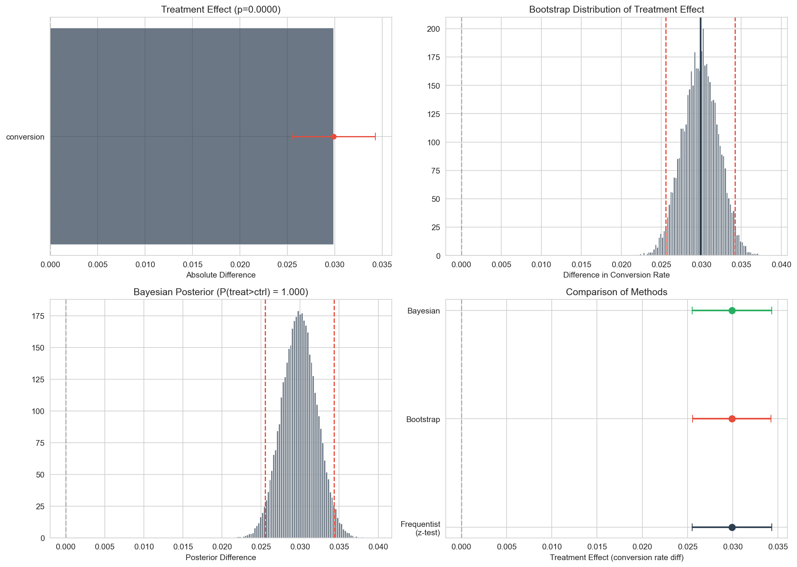
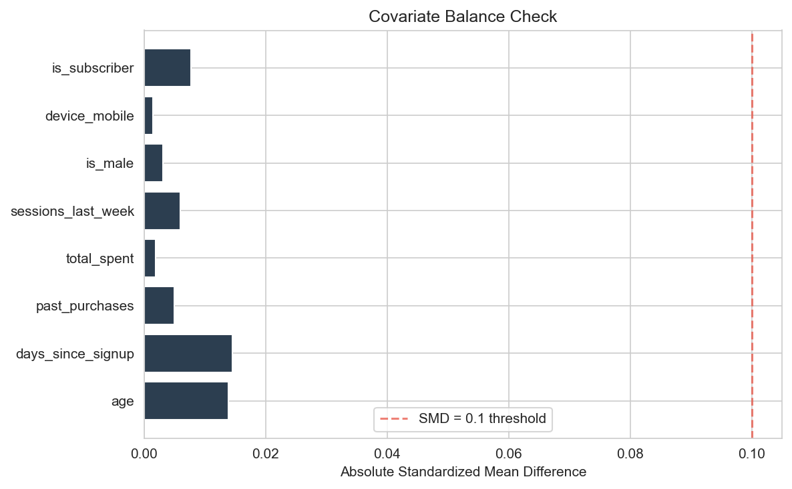
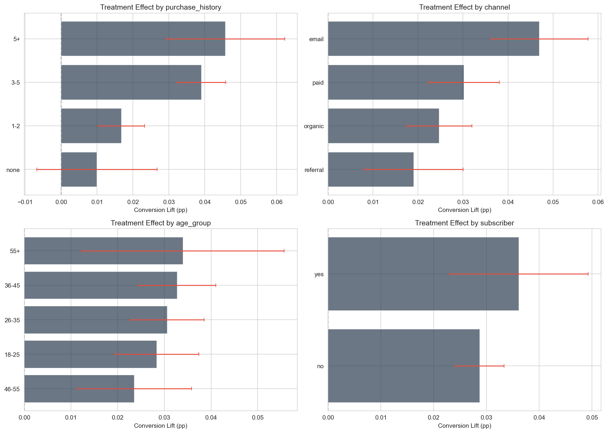
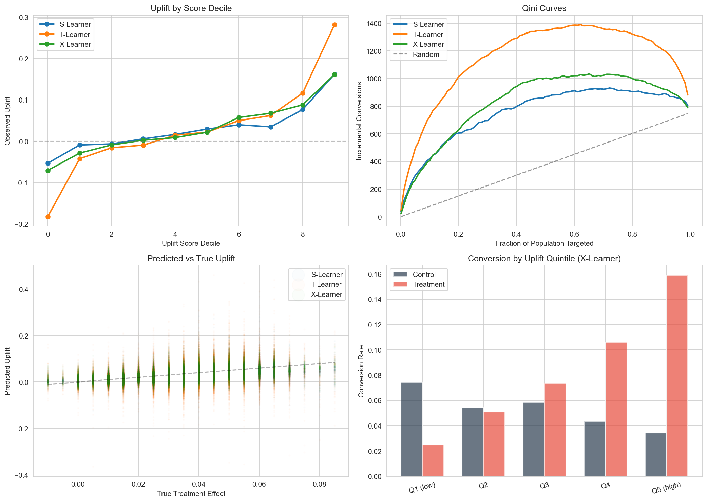
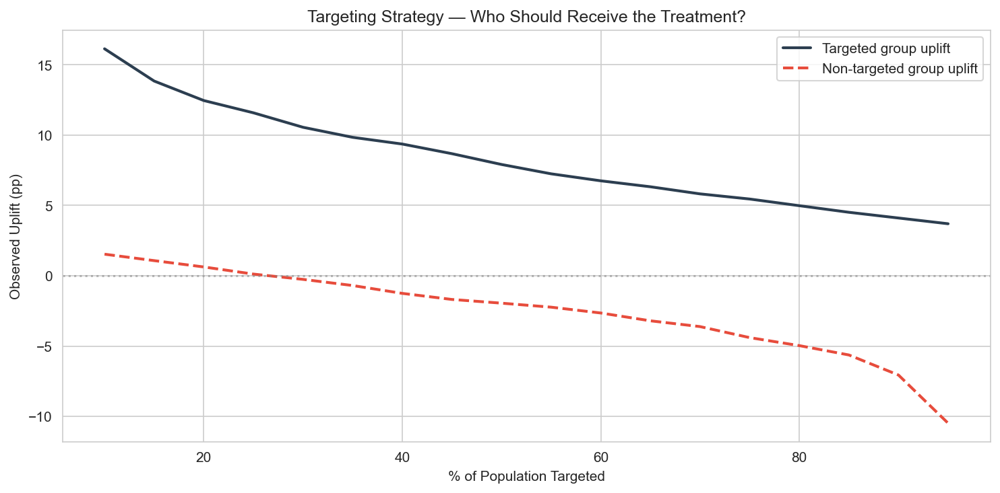
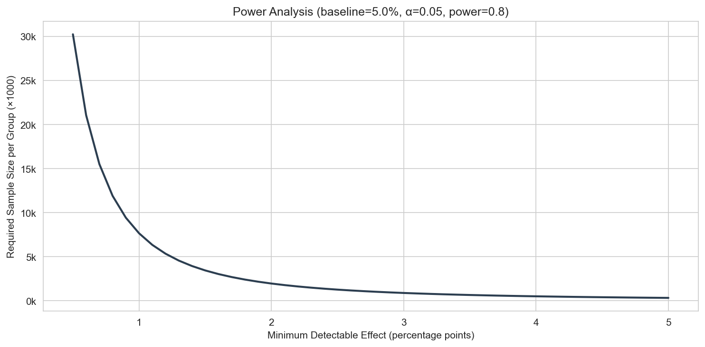

# A/B Testing: Frequentist, Bayesian & Uplift Analysis

A complete experimentation analysis pipeline: from randomization checks and statistical testing through heterogeneous treatment effect estimation using uplift models.

Uses synthetic data that simulates a conversion experiment with 50k users, realistic covariate distributions, and built-in heterogeneous treatment effects that vary by user segment.

**Stack:** Python, SciPy (Statistical Testing), LightGBM (Uplift Meta-Learners), Scikit-Learn, Bootstrap Simulation, Bayesian A/B Testing

---

## Results

The experiment simulates a product change tested on 50k users (25k treatment, 25k control). The treatment has a real average effect of ~1.5 percentage points on conversion, but this effect varies heavily by user segment.

### Overall Treatment Effect

| Method | Effect Size | 95% CI | p-value |
| :--- | :--- | :--- | :--- |
| Frequentist (z-test) | +3.0 pp | [2.55, 3.43] | < 0.0001 |
| Bootstrap (10k samples) | +3.0 pp | [2.55, 3.42] | < 0.0001 |
| Bayesian (Beta posterior) | +3.0 pp | [2.55, 3.43] HDI | P(treat > ctrl) = 1.00 |

Control conversion rate: 5.3%. Treatment conversion rate: 8.3%. Relative lift: 56.5%.

All three methods converge to the same estimate and interval width, which is expected with 25k samples per group — the CLT holds well. The Bayesian posterior gives the additional insight that the expected loss from choosing control is 0.030 (i.e., you'd give up 3 percentage points of conversion).

Revenue lift was also significant (Welch's t-test p < 0.0001, Mann-Whitney p < 0.0001): control $1.52 vs treatment $2.76 average revenue per user.



### Covariate Balance

All 10 covariates passed balance checks (SMD < 0.02, all p > 0.05), confirming valid randomization. No Simpson's paradox was detected.



### Segmented Effects

Treatment effects vary substantially by segment. Most segments remained significant after Bonferroni correction, which makes sense given the strong overall effect.

The biggest effect heterogeneity:
- Email channel users: ~4.8 pp (roughly 2.5x the effect on referral users at ~2.0 pp)
- Users with 5+ past purchases: ~4.5 pp (vs near-zero for users with no purchase history)
- Subscribers: ~3.5 pp (vs ~2.5 pp for non-subscribers)
- The 36-45 age group shows the strongest effect among age segments

This matters for targeting — if the treatment has a cost (e.g., a discount), you'd want to focus on the high-response segments.



---

### Sequential Peeking

Simulates what happens when you check p-values daily during the experiment. The p-value crosses 0.05 early (around day 5) and stays there, but this is misleading — repeated peeking inflates the false positive rate. The O'Brien-Fleming alpha spending function is overlaid to show how sequential testing controls for this.


---

### Uplift Modeling

Three meta-learner approaches estimate individual-level treatment effects:

- S-Learner — single model with treatment as a feature (score-uplift correlation: 0.985)
- T-Learner — separate models for treatment and control (correlation: 0.987)
- X-Learner — two-stage approach with imputed treatment effects (correlation: 0.996)

Because the data is simulated, we can compare predicted uplift against the true treatment effect. The X-Learner achieves the best score-uplift correlation (0.996) and the highest correlation with the true individual treatment effect (0.576).

The Qini curves show that all three models are substantially better than random targeting — the top 20% of users by predicted uplift capture a disproportionate share of the incremental conversions.



### Targeting Strategy

Using the X-Learner's predictions: if you target only the top 30% of users by predicted uplift, the observed uplift in that group is ~4.5 pp — roughly 1.5x the population average. The non-targeted group still has a positive but smaller effect (~2.0 pp), confirming that the model is successfully separating high-responders from low-responders.



---

### Power Analysis

Given the baseline 5% conversion rate, the power curve shows the sample size needed to detect effects of different sizes at 80% power and 5% significance. For a 1 pp MDE you'd need ~30k per group; for 2 pp, ~8k per group.



---

## How to Run

```bash
pip install -r requirements.txt
python main.py
```

No external data needed — the simulator generates everything. Takes about 90 seconds to run.

---

Requires Python 3.11.
